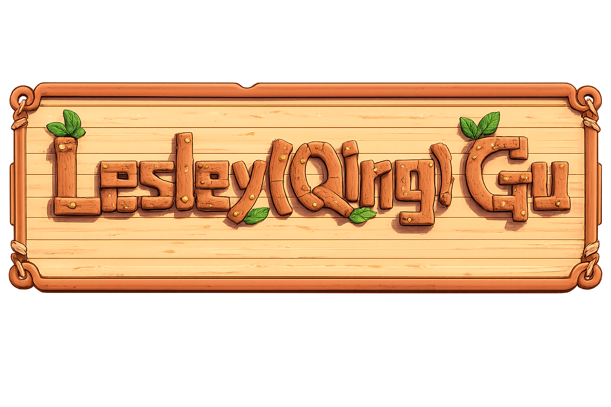

# 🎮 Pixel Portfolio - Stardew Valley Style

一个受《星露谷物语》启发的互动式像素风格作品集网站。通过探索不同的建筑来发现我的项目和作品。

An interactive pixel-art portfolio inspired by Stardew Valley. Explore different buildings to discover my projects and works.

## 📸 Preview

## ✨ Features

- 🎨 Pixel art style with retro gaming aesthetics
- 🌍 Multi-language support (English, 中文, Svenska)
- 🎮 Interactive character movement (WASD/Arrow keys)
- 🏠 Multiple project categories housed in different buildings
- ⌨️ Keyboard controls for navigation
- 🎭 Smooth scene transitions and animations

## 🛠️ Tech Stack

- **React 19** - UI framework
- **TypeScript** - Type safety
- **Vite** - Build tool and dev server
- **CSS3** - Styling and animations

## 🎮 Controls

- **WASD / Arrow Keys** - Move character
- **E / Enter / Space** - Interact with buildings
- **ESC** - Exit building or close modal
- **Click** - Navigate to location

## 📝 License

MIT License - feel free to use this project for your own portfolio!

## 👤 Author

**Lesley Gu (顾清)**

- GitHub: [@Lesley-Qing-Gu](https://github.com/Lesley-Qing-Gu)
